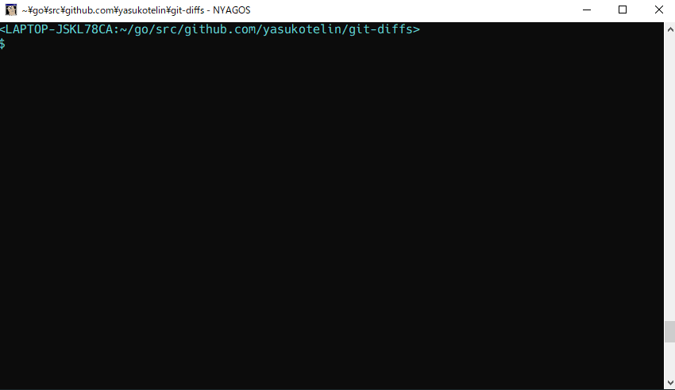

# git-diffs

git-diffs is the git subcommand that is diff files selector.

## Description

You can use the `git-diffs` as a git subcommand like `git diffs`.<br>
This shows diff file names and show diff when you select one.



## Install

If you have go environment, you can use `go get` and install.

```
go get -u github.com/yasukotelin/git-diffs
```

Or you can download the binary from [release](https://github.com/yasukotelin/git-diffs/releases) page. (only windows)


## Usage

```
$ git diffs
=== Staged files ===
[1] D   git.go
[2] M   main.go

=== Unstaged files ===
[3] M   README.md
[4] M   git/diff.go
[5] A   images/git-diffs-demo.gif

Select number (empty is cancel) =>
```

## Licence

MIT

## Author

yasukotelin
